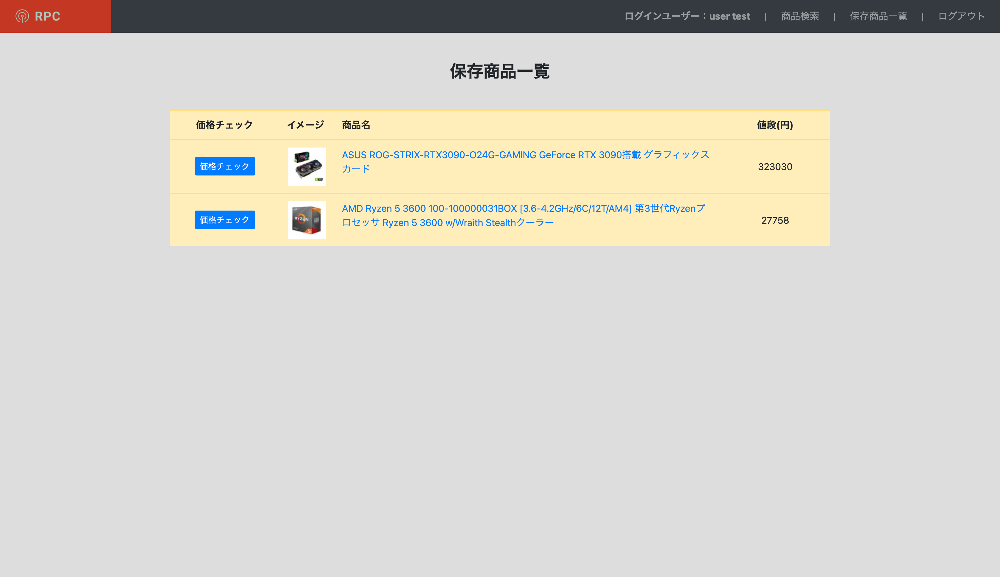
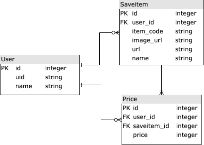

# RakutenPriceChecker_v2について
本アプリケーションはAPIを利用した開発を学ぶために作成したWebアプリです。楽天市場に出品されている商品を検索することができ、商品情報を保存することで価格の推移を自動でグラフ化することができます。
  
以下の情報でログイン可能です。  
メールアドレス：test.user.for.portfolio@gmail.com 
パスワード：Testuser2021
 
- [アプリケーションURL](https://rakutenpricechecker.herokuapp.com/)

## 実装機能について
実装されている機能に関しては以下のようになっています。
- Googleのアカウントを利用したログイン機能。
- 楽天市場に出品されている商品情報を取得、保存する機能。
- 保存した商品の価格を1日ごとにデータベースに自動で保存し価格推移グラフを作成する機能。

## データベース設計について
データベースの設計に関しては以下のER図の通りとなります。

## 使用した技術スタック
Bootstrap,　Ruby on Rails, PostgreSQL, Heroku, Heroku Scheduler, Google API, Rakuten API

## 使用している主なgemについて
- Rspec：　Railsの代表的なテストツールの一つ。単体テスト、統合テストを実行するために使用しました。
- Factory Bot：　テストのサンプルデータを簡単に作成することができるgem。
- omniauth-google-oauth2：　google認証機能を使用したログイン機能を実装するためのgem。
- rakuten_web_service：　Rakuten APIを使用するためのgem。
- chartkick：　グラフを描画するためのgem。